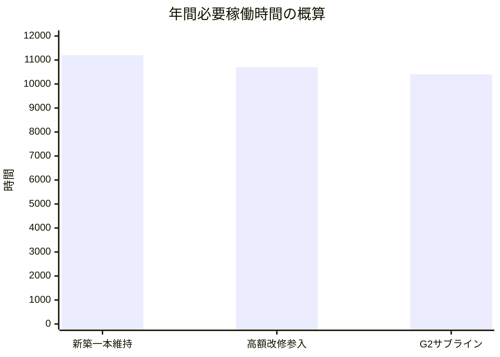
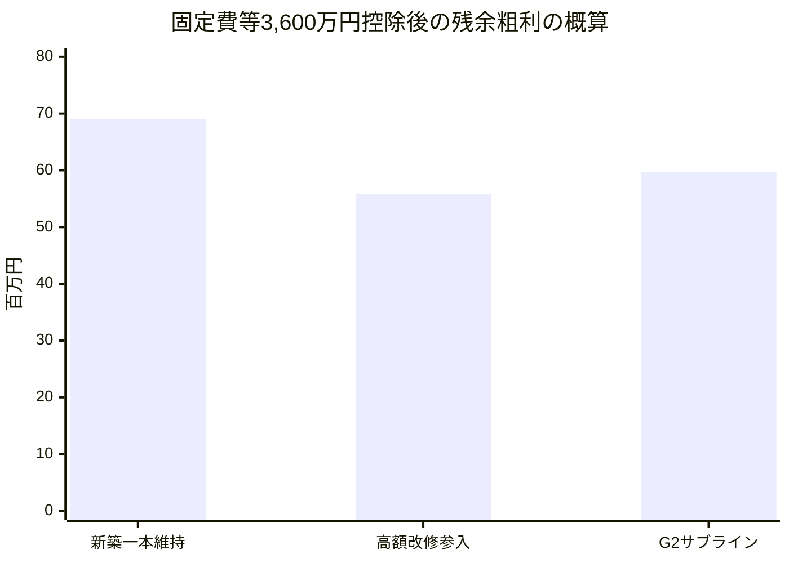
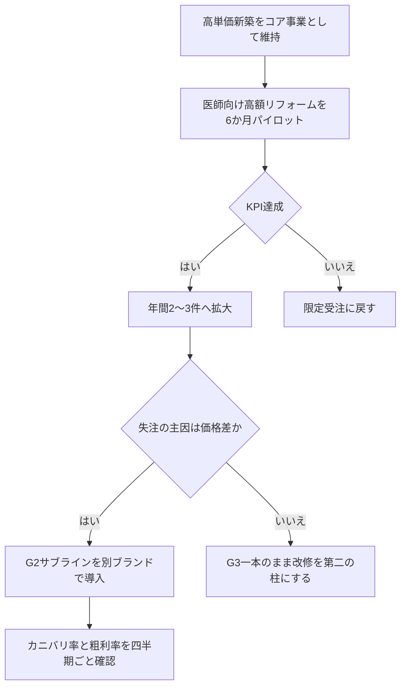

# 鳥取県東部の高性能工務店における戦略意思決定レポート

## エグゼクティブサマリ

結論から言うと、**「新築一本を完全に崩さず、医師層向け高額リフォームを小さく先行し、G2サブラインは後順位」**が最も合理的です。やまのすみか株式会社は公開情報ベースで**G3標準・年6〜8棟・粗利目標25%・固定費等約3,600万円**の会社であり、利益効率だけを見ると現状の高単価新築が最も強い一方、鳥取県東部では**診療所医師199人のうち65歳以上が46.7%**で、医師市場は「新築より改修・住み替え・建替え寄り」に傾く余地があります。 citeturn24view0turn35view0turn34view0

一方で、前提として置かれている**「鳥取県の新設住宅着工数が今後10年で70%減」**は、**鳥取県の公式予測ではありません**。これは山陰合同銀行のシミュレーションで示された下方シナリオで、同行自身が**「過少である可能性が高い」**と留保しています。しかも高級注文住宅に近い**持家**を見ると、鳥取県全体では**2018年度1,937戸→2024年度1,629戸**、鳥取市では**2018年度652戸→2024年度594戸**で、総着工ほどは落ちていません。したがって、経営判断に使うべきは**「5年で約15〜35%減を基本レンジ、10年70%減はストレスケース」**です。 citeturn13view0turn38view0turn4view1

## 市場前提の検証

やまのすみか株式会社の公開情報では、同社は**2019年から高断熱木造注文住宅の請負を開始し、G3を標準仕様**として、**年間6〜8棟**を施工、**2027年に12棟程度の着工**を目標としています。公開プロフィール上のメンバー構成は**4名＋社員大工2名＋主戦大工2名**で、代表は**二級建築施工管理技士・気密測定技能者**などを持つ技術寄りの経営者です。JBN会員でもあります。 citeturn24view0turn24view2turn24view3

収益面では、同社は自社サイトで**目標利益率25%**を明言し、**2024年度の会社維持費用が概ね3,600万円**と開示しています。加えて、家づくりの流れでは**契約時10%・上棟時30%・気密測定完了時30%・引渡し時残金**という、比較的キャッシュフローに優しい回収設計を採っています。これは「新築一本」の強みであり、改修事業と比較した時の重要な差です。 citeturn35view0turn37view0

鳥取県の住宅市場については、公式統計で**住宅全体の新設着工戸数が2023年度2,473戸、2024年度2,526戸**、うち**持家が2023年度1,685戸、2024年度1,629戸**です。鳥取市では**総着工が2018年度1,219戸から2024年度789戸へ減少**する一方、**持家は652戸から594戸**で、下落幅は相対的に小さいです。つまり、**総着工数の減少をそのまま高価格帯注文住宅の需要減と見なすのは危険**です。 citeturn38view0turn4view1

将来見通しでは、国立社会保障・人口問題研究所の推計で、鳥取県の**一般世帯総数は2025年221千世帯→2035年213千世帯→2050年184千世帯**へ減少します。さらに鳥取県公式Q&Aでは、**空き家率は2023年に15.8%**です。山陰合同銀行はこの世帯数推計と空き家率上昇・滅失仮定を用いて、鳥取県の住宅着工を**2026〜2030年度平均1,600戸、2031〜2035年度平均700戸**と試算し、**2023年度比で約35%減、約70%減**を示しましたが、同レポート自身が**「過少である可能性が高い」**と述べています。よって、**10年70%減は「悲観ストレスシナリオ」には使えるが、基本前提には重い**という評価が妥当です。 citeturn18view0turn29search7turn13view0

医師市場については、鳥取県医師確保計画で**東部医療圏の医師総数566人、人口10万人当たり252.1人**です。また外来医療計画では、東部の**一般診療所数184施設、一般診療所従事医師199人**、そのうち**65歳以上が46.7%**、**平均年齢62.0歳**と示されています。医師の所得面でも、厚労省資料では**医師の職種別平均賃金は時給換算4,905円**で、資料内の**産業計1,727円**を大きく上回ります。さらに医療経済実態調査では、**個人立の一般診療所（無床）の前年度損益差額は約2,583.9万円**で、開設者報酬以外に内部資金への充当余地も示唆されています。つまり、**医師層は支払能力が高い一方、東部で見た絶対数はそれほど大きくなく、しかも高齢化している**ため、「新築の極太市場」よりも「高単価改修・建替え・診療所併用の住環境改善市場」として捉える方が自然です。 citeturn4view2turn34view0turn28view0turn6view6

JBNとの整合性も重要です。JBNは**約3,000社の会員**を持ち、**高い基準の新築住宅、性能向上リフォーム、リノベーション**の研修を会員向けに提供しています。刊行物にも**「同時に行う省エネリフォーム＋断熱リフォーム」**や**「断熱リフォームはじめてガイド」**があり、団体としてのロードマップでも**外皮基準をG2レベルに引き上げる方向**を打ち出しています。したがって、やまのすみかのようなG3標準会社にとって、**G2は「先進差別化」より「標準化・量産化」に向く水準**であり、改修参入の学習コストはJBN活用で下げられます。 citeturn19search0turn32search0turn6view3

## 各選択肢の成立条件とリスク

まず、未指定部分について以下を仮定しました。**公開情報とユーザー前提にズレがある箇所は明示**します。

| 項目 | 置いた前提 |
|---|---|
| 現行高単価新築の平均単価 | 6,000万円/件（ユーザー前提） |
| 公開されている価格目安 | G3・30坪総二階で総予算3,600万円前後、平屋3,900万円程度 |
| 粗利率の基準 | 現行目標25%（会社公開値） |
| 年間固定費等 | 約3,600万円/年（会社公開値） |
| 従業員数 | 10名で試算。ただし公開情報では8名体制 |
| 年間有効プロジェクト時間 | 11,200時間/年（10名×1,600時間×稼働率70%の仮定） |
| 高額リフォーム平均単価 | 2,000万円/件（仮定） |
| G2サブライン平均単価 | 4,500万円/件（仮定） |

前提の根拠となる公開情報は、会社公開の粗利目標・固定費・価格帯・棟数・体制です。 citeturn24view0turn35view0

| 選択肢 | 先に挙げる失敗理由 | 成立条件 | 年間必要稼働の概算 | 想定粗利率の概算 | キャッシュフロー影響の概算 | 評価 |
|---|---|---|---:|---:|---|---|
| 高度リフォーム本格参入 | 医師市場が狭く、東部の一般診療所医師は199人しかいない。しかも高齢化が進み、新築より改修・住み替え寄りになりやすい。隠れ不具合で粗利が崩れやすく、代表の技術統括時間が細切れになる。 | 年2〜3件の**2,000万円級改修**を、紹介中心で継続受注。**見積粗利28%以上**、着工前診断有料化、追加工事の即時承認ルール、専任PM最低1名。 | 5棟新築＋3件改修で約**10,700時間** | 新築25%、改修28%を確保できて初めて成立 | 新築より不利。改修は解体・調査・追加工事で前倒し支出が出やすく、**同時2件で運転資金▲400万〜▲800万円**を見込むべき | **成立するが、限定先行が前提** |
| G2断熱仕様のサブライン新設 | 既存ブランドがG3・断熱等級7なのに、G2は「値頃感商品」と見られやすく、**高単価新築の自己カニバリ**が起きやすい。JBNロードマップ上もG2は普及側の水準で、差別化の moat が弱い。 | 失注分析で**「予算差だけが理由」**の案件が一定数あること。価格差を**1,000万〜1,500万円**作り、設計・監督時間を**20%以上短縮**。**粗利23%以上**、カニバリ率30%未満。 | 5棟新築＋2棟G2で約**10,400時間** | 新築25%、G2 23% | 新築に近く比較的安定。標準化できれば**案件当たり▲200万〜±0万円程度**に抑えやすい | **条件付きで成立** |
| 現状の新築注文住宅一本維持 | 利益効率は最も高いが、市場縮小・案件偏在・医師紹介の波で稼働がブレる。総着工より持家は粘るが、世帯減少・空き家増加は中長期逆風。 | 年間**5〜7棟**の高単価新築を維持し、手元受注残を**8か月以上**から落とさないこと。紹介源が偏りすぎないこと。 | 7棟で約**11,200時間** | 25% | 現在の回収設計が使え、**最も安定** | **短期は最強、長期は集中リスク** |

この表の「成立条件」は、公開されている会社の**粗利目標25%・固定費3,600万円・新築回収スケジュール**、東部医療圏の**医師数199人・平均年齢62.0歳・65歳以上46.7%**、JBNの**G2方向性と改修支援**を踏まえた定量化です。 citeturn35view0turn37view0turn34view0turn6view3turn32search0

ここで重要なのは、**粗利の絶対額と粗利/時間**です。ユーザー前提の6,000万円新築を粗利率25%で取れるなら、**1棟当たり粗利1,500万円**です。これに対して2,000万円改修を28%で受けても**粗利560万円**なので、**高額改修は約2.7件で新築1棟分の粗利**をようやく置き換える構造です。G2サブライン4,500万円を23%で回すと**粗利1,035万円**で、**高単価新築1棟分の粗利を補うには約1.45棟**必要です。よって、**改修は利益最大化策ではなく稼働平準化策、G2はカニバリ管理が要る稼働維持策**です。 citeturn35view0turn24view0

## 稼働時間と収益シミュレーション

以下のシミュレーションは、**会社公開の粗利目標25%・固定費約3,600万円・新築回収スキーム**を土台に、ユーザー前提の**平均新築単価6,000万円**を置いて比較したものです。会社の公開価格目安はこれより低いため、ここは**現実の平均請負額がどちらに近いかで大きく結果が変わる**点に注意が必要です。 citeturn35view0turn37view0

| 指標 | 高単価新築 | 高額リフォーム | G2サブライン |
|---|---:|---:|---:|
| 1件当たり単価 | 6,000万円 | 2,000万円 | 4,500万円 |
| 1件当たり粗利 | 1,500万円 | 560万円 | 1,035万円 |
| 1件当たり社内投入時間 | 1,600時間 | 900時間 | 1,200時間 |
| 粗利/社内投入時間 | 9,375円/h | 6,222円/h | 8,625円/h |
| 固定費3,600万円を回収する必要件数 | 2.4件 | 6.4件 | 3.5件 |

高単価新築が最も強いのは、**公開されている回収条件が良いこと**と、**同じ社内時間あたりの粗利が最も高いこと**の二重の理由です。一方で、会社公開の価格目安である**3,600万円前後/棟**を使うと、固定費回収に必要な新築棟数は**4棟**まで増えます。したがって、**実際の平均請負額**は、この結論を左右する最重要データです。 citeturn35view0

上のグラフは、次の年次ポートフォリオを仮定しています。**新築一本維持**は高単価新築7棟、**高額改修参入**は高単価新築5棟＋高額改修3件、**G2サブライン**は高単価新築5棟＋G2 2棟です。利益効率だけなら現状維持が最も高い一方、**改修参入は利益率を落としても紹介医師市場の高齢化に適合しやすく、G2は利益効率を比較的保ちながら受注裾野を広げうる**、という読みになります。 citeturn24view0turn35view0turn34view0

キャッシュフローでは差がさらに大きく出ます。新築は会社公開の回収スケジュールが強く、**契約時10%＋工事中60%を回収**するため、案件当たりの資金負担は相対的に軽いです。G2サブラインもこのスキームを流用できれば近い挙動になります。これに対して高額リフォームは、解体・調査・追加工事が前半に出やすく、診断・見積・変更合意の遅れで資金が寝やすいので、**診断有料化・変更契約の即日締結・前受金30%以上**をルール化しないと、粗利より先に資金繰りで苦しくなります。 citeturn37view0

## 推奨実行順序と根拠

推奨順序は、**現状の高単価新築をコアとして維持しつつ、医師向け高額リフォームを限定パイロットで先に実行し、その結果を見てからG2サブラインを検討**です。理由は三つあります。

第一に、**足元の利益効率と資金回収は現状新築が最も強い**からです。会社公開情報の粗利目標25%、固定費等3,600万円、新築の進捗回収設計を見る限り、まずこの基盤を崩す合理性は乏しいです。 citeturn35view0turn37view0

第二に、**医師市場の構造が「新築増」より「改修・更新」寄り**だからです。東部の一般診療所医師は199人で、65歳以上が46.7%、平均年齢62.0歳です。この構造では、20〜40代の勤務医の新築需要を広く刈り取るより、**開業医・中高年勤務医・医院承継層に対する高断熱改修、二世帯化、在宅医療対応、水回り・温熱改善、クリニック併用住宅の改修**の方が刺さりやすい可能性があります。しかも同社はすでに**敷地調査3万円、設計着手22万円**という「前工程有料化」に慣れており、これは改修診断の有料化に転用しやすいです。 citeturn34view0turn37view0

第三に、**G2サブラインを先にやると、ブランド毀損とカニバリを先に招きやすい**からです。やまのすみかは公開情報上、**G3標準・断熱等級7**の会社であり、代表自身もNE-STやRe NE-STの制度設計に関わってきました。その会社が先にG2を前面に出すと、「価格を下げたやまのすみか」と理解される危険があります。JBNのロードマップ上もG2はむしろ今後の普及水準です。**G2はパイロット改修のKPIを見た後、失注理由が本当に価格であると確認できた場合だけ、別名称・別ルールで導入する方が安全**です。 citeturn24view3turn6view3

反証可能な仮説は、以下のように置くのがよいです。

| 仮説 | 成立なら進める基準 | 反証されたら止める基準 |
|---|---|---|
| 医師向け高額リフォームは成立する | 半年で**有効商談6件以上**、うち**有料診断3件以上**、**2件受注**、最終粗利**27%以上** | 半年で有効商談3件未満、または受注しても粗利25%未満 |
| G2サブラインは受注平準化に効く | 失注案件のうち**25%以上が「予算差だけ」**、G2の設計監督時間が現行比**20%以上短縮** | 失注理由が価格以外中心、または既存のG3客がG2へ流れる比率が**30%以上** |
| 新築一本維持で十分 | 12か月先までの受注残が**8か月以上**、医師・紹介経由の成約率が社内基準を上回る | 受注残が**6か月未満**へ連続低下し、月次稼働の谷が埋まらない |

推奨フローは次の通りです。

## この結論を覆しうる追加確認事項

この結論を最も大きく覆しうるのは、**公開情報とユーザー前提がズレている「実際の平均請負額」と「実際の工数」**です。ここが違えば、3案の優先順位は変わりえます。特に以下の未提供データは、ほぼ必須です。

| 未提供データ | なぜ重要か | これが出ると何が変わるか |
|---|---|---|
| 直近24か月の受注一覧 | 実際の**平均単価、粗利率、工期、担当者負荷**が分かる | 6,000万円/件が本当に平均なら新築一本の優位は大きい。3,600〜4,000万円中心なら分散策の必要性が上がる |
| 失注理由の記録 | **価格負け**なのか、**性能過多**なのか、**時期**なのかを分けられる | G2サブラインの必要性を定量判断できる |
| 紹介源別の成約率 | 医師会、既存顧客、設計士、金融機関などの質が見える | 高額リフォームをどのチャネルで始めるべきか決まる |
| 月別の現場稼働率 | 「谷」がどの月にどれだけあるか分かる | 補完策が改修なのか、G2なのか、採用調整なのかが変わる |
| 手元資金と借入余力 | 改修同時進行時の**運転資金耐性**が分かる | 高額改修を何件同時に回せるかが決まる |
| 医師顧客の内訳 | 開業医と勤務医の比率、年齢、建築意向の差が分かる | 「新築」「改修」「医院併用」のどこに寄せるべきかが変わる |
| OB顧客の築年・性能・メンテ履歴 | 改修の初期案件をOB中心で作れるか分かる | 医師限定でなくても高額改修の立ち上がりが早まる |
| 代表の実稼働配分 | 技術統括・営業・設計監修の時間制約が見える | 改修参入の上限件数、G2同時展開の可否が決まる |

要するに、**現時点の最適解は「③をコアに残しながら①を小さく始め、②はデータが揃ってから判断」**です。ただし、この結論は**平均請負額、失注理由、月別稼働率、手元資金**の4点で容易に反転します。特に平均請負額は、会社公開価格では3,500万〜3,900万円帯、ユーザー前提では6,000万円帯で、ここに大きなギャップがあります。ここが埋まれば、意思決定の精度は一段上がります。 citeturn35view0turn24view0